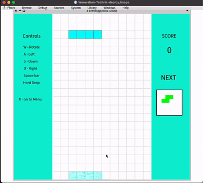

# Woowahan-Techris
A  game developed to explore Smalltalk OOP and Pharo live programming

---
## Contents
- [프로젝트 개요](#프로젝트-개요)
- [주요 기능](#주요-기능)
- [기술 스택](#기술-스택)
- [개발 과정](#개발-과정)
- [빌드 방법](#빌드-방법)
- [Contributors](#contributors)
--- 

## 프로젝트 개요
MVC 패턴을 학습하다가 발견한 Smalltalk과 Pharo로 재현한 테트리스입니다.
"모든 것은 객체이고, 모든 것은 메시지다"라는 Smalltalk의 철학을 경험하기 위해 시작했습니다.

---

## 기술 스택
- **Language: Smalltalk (Pharo 14)**
- **UI: Pharo Morphic**

## 주요 기능
- **7가지 테트로미노**: I, O, T, S, Z, J, L 블록으로 클래식 테트리스 구현
- **테트로미노 조작**: 좌우 이동, 회전, 소프트 드롭, 하드 드롭 지원
- **점수 시스템**: 라인 클리어 개수에 따른 점수 차등 부여 (1줄 100점 ~ 4줄 800점)
- **고스트 블록**: 테트로미노가 떨어질 위치를 미리 확인
- **다음 블록 표시**: 다음에 나올 테트로미노 preview

## 플레이 화면



--- 
## 개발 과정

- [[Techris] 1. 요구사항 분석](https://choijw1004.github.io/posts/41/)
- [[Techris] 2. 개발 환경 세팅](https://choijw1004.github.io/posts/42/)
- [[Techris] 3. Deep Dive into Smalltalk](https://choijw1004.github.io/posts/43/)
- [[Techris] 4. Techris를 설계해보자](https://choijw1004.github.io/posts/44/)
- [[Techris] 5. Techris의 도메인 로직](https://choijw1004.github.io/posts/45/)
- [[Techris] 6. Techris의 UI](https://choijw1004.github.io/posts/46/)
- [[Techris] 7. Techris의 배포](https://choijw1004.github.io/posts/47/)

## 실행 파일로 플레이 (Mac 전용)

현재 **맥북 실리콘(M1~)** 환경에서만 실행 가능합니다.

1. **다운로드**: [Techris.zip](https://drive.google.com/file/d/15C3aj-xmvqJDhSPPMQMCxRYVTbipasFr/view?usp=drive_link)
2. **압축 해제**: 다운로드한 파일의 압축을 해제합니다.
3. **터미널 실행**:
```bash
   cd Techris
   ./run.command
```

--- 
## Contributors
||
|:-:|
|최장우<br/>[@choijw1004](https://github.com/choijw1004)|